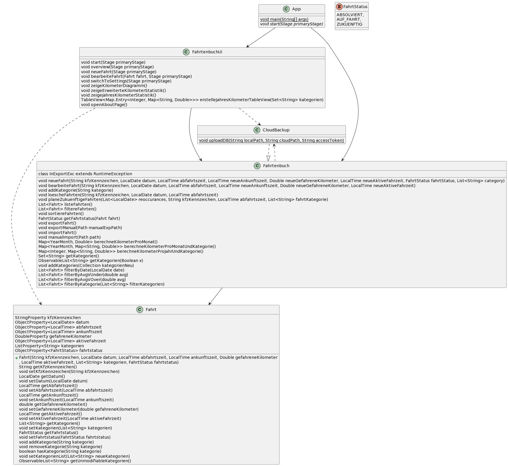
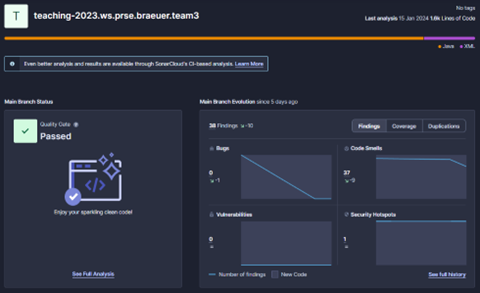
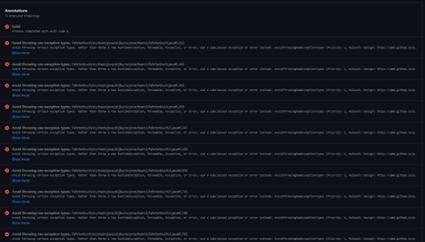
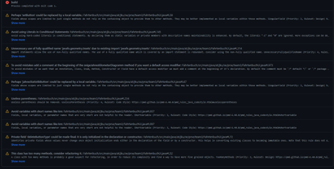

# Team 3

Hannes Mayrhofer, Markus Lindner, Sara Kheribi, Milan Keta

# Projektdokumentation


# 1. Einleitung

## Architektur der Applikation

- Das Model besteht aus den Klassen Fahrtenbuch, Fahrt und FahrtStatus die die Kernlogik und die Datenstruktur der Anwendung darstellen. Diese Klassen sind für die Verwaltung der Fahrtdaten verantwortlich, einschließlich Operationen wie Speichern, Laden, Bearbeiten und Löschen von Einträgen sowie die Bereitstellung von statistischen Daten.
- Die View wird durch die Klasse FahrtenbuchUI repräsentiert, die die grafische Benutzeroberfläche (GUI) der Anwendung bildet. Diese Klasse nutzt JavaFX-UI-Komponenten, um die Daten in einer benutzerfreundlichen Form darzustellen. Dazu gehören Tabellenansichten für die Auflistung der Fahrten, Formulare für die Dateneingabe, Diagramme für statistische Darstellungen und verschiedene Steuerelemente wie Buttons und Menüs für die Interaktion mit der Anwendung.
- Der Controller ist in der FahrtenbuchUI-Klasse integriert und handhabt die Benutzerinteraktionen. Er reagiert auf Benutzereingaben, leitet die Anfragen an das Model weiter und aktualisiert die View basierend auf den Rückmeldungen und Datenänderungen. Diese Schicht sorgt dafür, dass die Benutzeroberfläche und das Datenmodell synchronisiert und konsistent bleiben.

##


#


# 2. Umgesetzte Anforderungen

### 1. Verwaltung von Fahrtdaten

- **Erfassung neuer Fahrten:** Man kann über ein spezielles Eingabeformular neue Fahrten hinzufügen. Dieses Formular erfasst relevante Informationen wie KFZ-Kennzeichen, Datum, Uhrzeit, gefahrene Kilometer und Kategorien.
- **Bearbeitung bestehender Fahrten:** Aus der Übersichtstabelle heraus können Benutzer eine Fahrt auswählen und über ein Dialogfenster bearbeiten. Änderungen können an verschiedenen Datenpunkten, wie Datum oder Kilometer, vorgenommen werden.
- **Löschen von Fahrten:** Benutzer haben die Möglichkeit, ausgewählte Fahrten zu löschen.

### 2. Anzeige und Filterung von Fahrtdaten

- **Übersichtliche Darstellung:** Die Hauptansicht zeigt eine Tabelle aller erfassten Fahrten. Diese Tabelle bietet eine klare und strukturierte Übersicht.
- **Filterfunktionen:** Benutzer können Fahrtdaten nach verschiedenen Kriterien wie Datum, Durchschnittsgeschwindigkeit und Kategorien filtern. Diese Funktionalität verbessert die Benutzerfreundlichkeit, insbesondere bei einer großen Anzahl von Fahrten.

### 3. Statistische Auswertungen

- **Grafische Darstellungen:** Die Applikation bietet die Möglichkeit, statistische Daten in Form von Balkendiagrammen zu visualisieren. Dies umfasst beispielsweise die Anzeige der gefahrenen Kilometer pro Monat oder Jahr.
- **Erweiterte Statistiken:** Neben den Basisstatistiken können Benutzer auch detaillierte statistische Auswertungen einsehen, die eine tiefere Analyse der Fahrtdaten ermöglichen.

### 4. Datenexport und -import

- **Speichern von Daten:** Die Applikation bietet eine Exportfunktion, mit der die erfassten Fahrtdaten in einer CSV-Datei gespeichert werden können. Dies ist nützlich für die Datensicherung und weitere Verarbeitung außerhalb der Applikation.
- **Laden von Daten:** Ebenso können Benutzer Daten aus einer CSV-Datei importieren, was den Datenaustausch mit anderen Systemen erleichtert.
- **Exportieren in die Cloud**: Die Anwendung bietet auch die Auslagerung der Daten an den Clouddienst Dropbox. Diese Funktionalität ermöglicht ein höheres Maß an Datensicherheit.

### 1. Benutzeranpassungen und Einstellungen

- **Kategorienverwaltung:** Benutzer können Kategorien hinzufügen, bearbeiten oder entfernen. Dies ermöglicht eine individuelle Anpassung der Kategorisierung von Fahrten.
- **Anpassung von Einstellungen:** Es können Einstellungen wie den Speicherpfad für den Export angepasst werden, was zusätzliche Flexibilität bietet.

# Überblick über das System aus Entwicklersicht


##


##


# 4. Sonarcloud & PMD

**Sonarcloud:**



PMD\_



# JavaDoc für wichtige Klassen, Interfaces und Methoden

## Klasse FahrtenbuchUI:

### Kernfunktionalitäten
- **Anfangsbildschirm (Startfenster)**: Initialisiert und zeigt den Startbildschirm der Applikation an.
- **Übersichtsbildschirm (Hauptbildschirm)**: Stellt eine Übersichtstabelle aller Fahrten dar und ermöglicht Benutzerinteraktionen wie das Filtern von Daten und das Öffnen weiterer Fenster für detaillierte Funktionen.
- **Neue Fahrt anlegen**: Erlaubt dem Benutzer, eine neue Fahrt mit allen relevanten Details anzulegen.
- **Fahrt bearbeiten**: Ermöglicht das Bearbeiten der Details einer ausgewählten Fahrt.
- **Statistische Auswertungen anzeigen**: Zeigt verschiedene statistische Ansichten, wie Jahresstatistik und erweiterte Kilometerstatistik.
- **Export/Import von Daten**: Implementiert Funktionen zum Speichern und Laden der Fahrtdaten in bzw. aus CSV-Dateien.
- **Einstellungen verwalten**: Bietet einen Einstellungsbildschirm, in dem Benutzer die Kategorien verwalten und Einstellungen wie den Speicherpfad anpassen können.

### Wichtige Methoden
#### `public void start(Stage primaryStage)`
Diese Methode ist der Einstiegspunkt für die JavaFX-Anwendung. Sie initialisiert und zeigt den Startbildschirm der Applikation an.

#### `private void overview(Stage primaryStage)`
Erstellt und zeigt den Hauptbildschirm der Applikation, inklusive der Fahrtentabelle und verschiedener Steuerungselemente.

#### `private void neueFahrt(Stage primaryStage)`
Öffnet ein Fenster, in dem der Benutzer eine neue Fahrt anlegen kann.

#### `private void bearbeiteFahrt(Fahrt ausgewaehlteFahrt, Stage primaryStage)`
Ermöglicht das Bearbeiten einer ausgewählten Fahrt.

#### `private void switchToSettings(Stage primaryStage)`
Zeigt ein Einstellungsfenster für die Verwaltung von Kategorien und Einstellungen wie dem Speicherpfad.

#### `private void initializeStatistikMenuButton()`
Initialisiert einen Menü-Button für statistische Ansichten.

#### `private void initializeGrafikMenuButton()`
Initialisiert einen Menü-Button für grafische Darstellungen der Statistiken.

#### `void zeigeKilometerDiagramm()`
Erstellt und zeigt ein Balkendiagramm der gefahrenen Kilometer pro Monat und Kategorie.

#### `void zeigeJahresKilometerDiagramm()`
Ähnlich wie `zeigeKilometerDiagramm`, aber zeigt die Gesamtkilometer pro Jahr und Kategorie.

#### `private TableView<Map.Entry<Integer, Map<String, Double>>> erstelleJahresKilometerTableView(Set<String> kategorien)`
Erstellt eine TableView für die Darstellung von Jahreskilometern pro Kategorie.

#### `void zeigeErweiterteKilometerStatistik()`
Zeigt eine detaillierte Statistik der gefahrenen Kilometer pro Monat und Kategorie in einer TableView.

#### `private TableView<Map.Entry<YearMonth, Map<String, Double>>> erstelleErweiterteKilometerTableView(Set<String> kategorien)`
Erstellt eine TableView für die detaillierte Darstellung von Kilometern pro Monat und Kategorie.

#### `private void aktualisiereErweiterteKilometerTabelle(TableView<Map.Entry<YearMonth, Map<String, Double>>> tableView)`
Aktualisiert die Tabelle der erweiterten Kilometerstatistik mit den neuesten Daten aus dem Fahrtenbuch.

#### `void zeigeJahresKilometerStatistik()`
Zeigt eine Statistik der gefahrenen Kilometer pro Jahr und Kategorie in einer TableView.

#### `void oeffneFilter(TableView fahrtenTabelle)`
Öffnet ein Dialogfenster zur Filterung von Fahrten nach verschiedenen Kriterien.

#### `private void exporterMethod(String exportPath) throws IOException`
Nimmt einen Path String und exportiert mittels CSVWritter die Daten aus Fahrtenbuch.fahrten und Fahrtenbuch.kategorien.

#### `private void importerMethod(Path importPath)`
Nimmt einen Path String und importiert mittels CSVReader die Daten aus dem angegebenen Verzeichnis und speichert sie in Fahrtenbuch.fahrten und Fahrtenbuch.kategorien.

## Klasse Fahrtenbuch:

### 1. Konstruktoren
- `Fahrtenbuch(List<String> kategorien, List<Fahrt> fahrten)`: Erstellt ein Fahrtenbuch mit vorgegebenen Kategorien und Fahrten.
- `Fahrtenbuch()`: Erstellt ein leeres Fahrtenbuch, nützlich beim ersten Start der Applikation.

### 2. Methoden zur Verwaltung von Fahrten
- `neueFahrt(...)`: Fügt eine neue Fahrt hinzu.
- `bearbeiteFahrt(...)`: Ermöglicht die Bearbeitung einer bestehenden Fahrt.
- `loescheFahrten(...)`: Löscht eine spezifische Fahrt basierend auf Schlüsselinformationen.
- `planeZukuenftigeFahrten(...)`: Plant wiederkehrende Fahrten.

### Methoden zur Datenabfrage und -aufbereitung
- `listeFahrten()`: Gibt eine Liste aller erfassten Fahrten zurück.
- `berechneKilometerProMonat()`: Berechnet die insgesamt gefahrenen Kilometer pro Monat.
- `berechneKilometerProMonatUndKategorie()`: Berechnet die gefahrenen Kilometer pro Monat und Kategorie.
- `berechneKilometerProJahrUndKategorie()`: Berechnet die gefahrenen Kilometer pro Jahr und Kategorie.

### Kategorienverwaltung und Filterung
- `addKategorie(String kategorie)`: Fügt eine neue Kategorie hinzu.
- `getKategorien()` und `getKategorien(Boolean x)`: Gibt eine Liste aller einzigartigen Kategorien zurück.
- `addKategories(Collection kategorienNeu)`: Fügt eine Sammlung von Kategorien zur Liste hinzu.
- Filtermethoden (`filterByDate`, `filterByAvgVUnder`, `filterByAvgVOver`, `filterByKategorie`): Ermöglichen es, Fahrten nach verschiedenen Kriterien zu filtern.

### Export und Import von Daten
- `exporterMethod`: Speichert Daten in ausgewähltem Pfad.
- `importerMethod`: Importiert Daten von ausgewähltem Pfad.
- `exportFahrt()`: Ruft `exporterMethod` mit Pfad des standard Speicherortes auf.
- `importFahrt()`: Ruft `importerMethod` mit Pfad des standard Speicherortes auf.
- `manualImport(Path path)`: Ruft `importerMethod` mit Pfad eines ausgewählten Speicherortes auf.
- `ExportManual(Path path)`: Ruft `exporterMethod` mit Pfad eines ausgewählten Speicherortes auf.

# Installationsanleitung

Nachdem Sie das Maven-Projekt gebaut haben, können Sie die Applikation wie folgt ausführen:

1. Öffnen Sie ein Terminalfenster.
2. Wechseln Sie in das Verzeichnis, in dem sich die generierte JAR-Datei befindet. Dies ist typischerweise das target-Verzeichnis im Projektordner:

   ```bash
   cd Pfad/zum/Projekt/target
java -jar Fahrtenbuch-1.0-SNAPSHOT.jar
